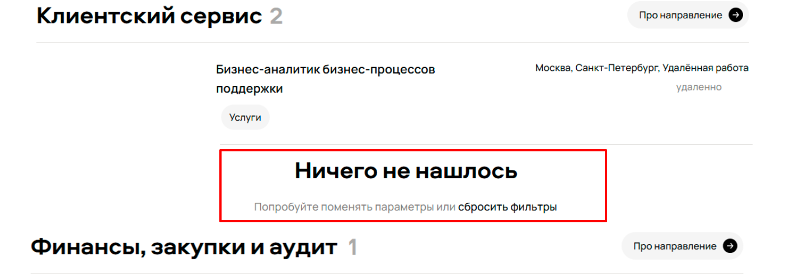
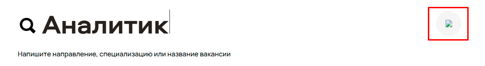
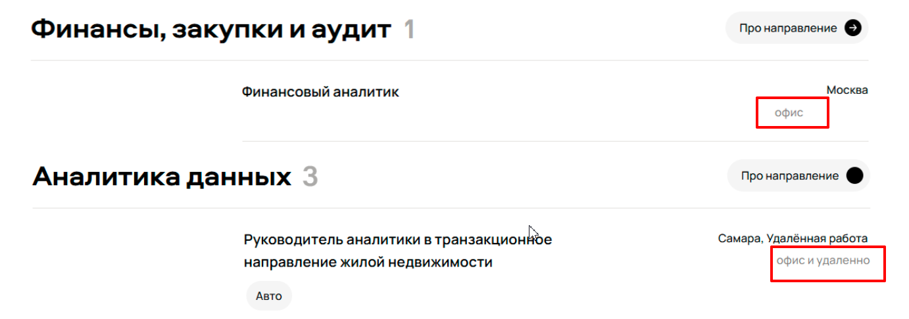
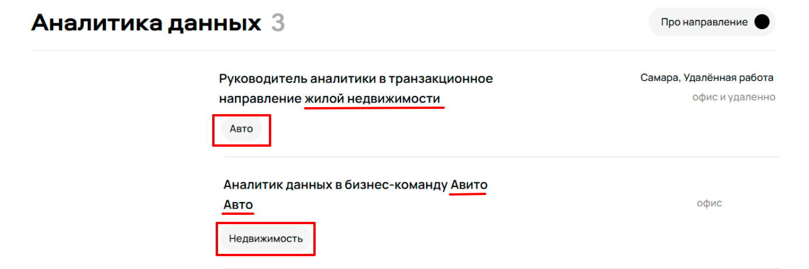

1. Некорректная работа поиска. 
В поисковой строке ввели слово "аналитик", в результатах встречаются вакансии, не относящиеся к аналитике и не содержащие 
введенное ключевое слово, например, "Руководитель Data Science в команду монетизации".
Приоритет high, так как поиск - одна из основных функциональностей страницы
2. Некорректная работа фильтров.
2.1. Фильтр по городам.
В фильтре по городам выбран Санкт-Петербург, в результатах встречаются вакансии в Москве и Самаре
2.2. Фильтр по направлению
Выбран подраздел "Поддержка пользователей" в направлении "Data Science", в резульатах вакансии явно не соответстующие этому критерию.
2.3. Дополнительные фильтры
Выбран фильтр "Руководящая роль", в результатах указаны в том числе не руководящие должности, например, "Финансовый аналитик"
Приоритет high, фильтрация - одна из основных функциональностей страницы
3. Среди результатов поиска отображается блок "Ничего не нашлось"
Явно нарушена логика отображения этого блока, либо его не должно быть совсем, либо должен быть только этот блок без списка вакансий
Приоритет high, вводит пользователя в заблуждение, свидетельствует об очевидной ошибке.

3.1. Также из-за этого блока возникает ошибка с отображением кол-ва вакансий в категории "Клиентский сервис", указано 2 вакансии, но
из-за блока "Ничего не найдено" вторая вакансия не отображается, либо её нет совсем, тогда неправильно работает счетчик вакансий
по категориям.

4. В поисковой строке не отображается иконка сброса поиска
Не очевидно, для чего предназначена эта кнопка, аватар или кнопка сброса
Приоритет medium, не блокирует основную функциональность, пользователь может удалить слово с клавиатуры, но влияет на визуальное 
восприятие страницы и вызывает вопросы о том, что скрывается за иконкой

5. Некорректное сообщение в выпадающем списке для фильтра "Команды"
Приоритет medium, баг вводит пользователей в заблуждение, корректней указать, что нет подходящих команд 

6. Для вакансии "Аналитик данных в бизнес команду Авито Авто" не указан город, хотя формат работы в офисе
Приоритет medium, не указана важная информация для пользователя

7. Форматы работы в списке вакансий указываются с разными отступами 
Приоритет low, никак не влияет на функциональность, но влияет на визуальное восприятие

8. В разделеле "Аналитика данных" на кнопке "Про направление" нет иконки стрелки, как во всех остальных разделах
Приоритет low, не влияет на функциональность, влияет на визуальное воспроиятие и удобство использования

9. В футере страницы ошибка в написании слова "вакансий" во множественном числе
Приоритет low, влияет на имидж компании

10. Неправильно указаны категории для вакансий, например, вакансия "Аналитик по стратегии" относится к категории "Товары";
Вакансии в Авито Авто относятся к категории "Недвижимость" и наоборот.
Очевидная логическая ошибка, приоритет low, влияет на имидж компании

11. Проблемы с версткой страницы: разный размер заголовоков категорий, разные отступы
Приоритет low, влияет на визуальное восприятие страницы
